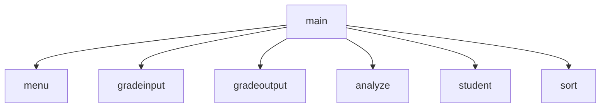

# Student Grade Management System
Seb, Will, Mason, Gideon

## Student Grade Management System
Your team has been hired to create a Student Grades Management System.  Your team will  apply key programming concepts such as functions, arrays, file I/O, search algorithms, and sorting algorithms. The system will allow users to manage student data, perform analyses, and display meaningful results.

### Grade Management Flowchart

#### Function Diagrams

| `Main Function`   |               |  Will     |
| ------------------ | ------------- | ------------ |
| `no argument:void`    | Gets the input for how many grades they would like to input |              |
| `grades, double array`     | 2d list where the first element is the name and the next 5 are the grades | outputs entire program    |
| `name:string`      | takes input from functions | returns nothing |
***
| `menu`    |               |     Will  |
| ------------------ | ------------- | ------------ |
| `no arguments`    | t  |  gets an input from 1-8            |
| `choice variable`     | calculates nothing  |   displays menu          |
| `returns choice (1-5)`      | takes input for name choice | returns choice |
***
| `gradeinput`    |               |     Seb   |
| ------------------ | ------------- | ------------ |
| `no arguements`    | takes input for 1 at a time  |              |
| `grade variable`     | calculates nothing  | outputs seats using array             |
| `returns grade`      | takes input for grade | returns grade |
***
| `gradeoutput`    |               |     Seb   |
| ------------------ | ------------- | ------------ |
| `accepts array grades,student amount`    |   outputs the grades |              |
| `grade variable`     | caluclates nothing |             |
| `returns nothing`      | returns nothing| returns prices |
***
| `analyze`    |               |     Seb   |
| ------------------ | ------------- | ------------ |
| `accepts array grades, student amount`    | displays average grades |              |
| `average variable`     | calculates average grades  | outputs average grade +highest and lowest            |
| `returns nothing`      | takes input for name ticket | returns nothing |
***
| `student`    |               |     Mason   |
| ------------------ | ------------- | ------------ |
| `accepts array grades,student amount`    | takes input for student of choice  |              |
| `student`     | calculates nothing  | finds where the  student in the input is and grades         |
| `returns nothing`      |  | returns nothing |
***
| `sort`    |               |     Gideon  |
| ------------------ | ------------- | ------------ |
| `accepts array grades,student amount`    | takes no input  |              |
| `student`     | calculates nothing  | sorts based on average         |
| `returns nothing`      |  | returns nothing |
***
